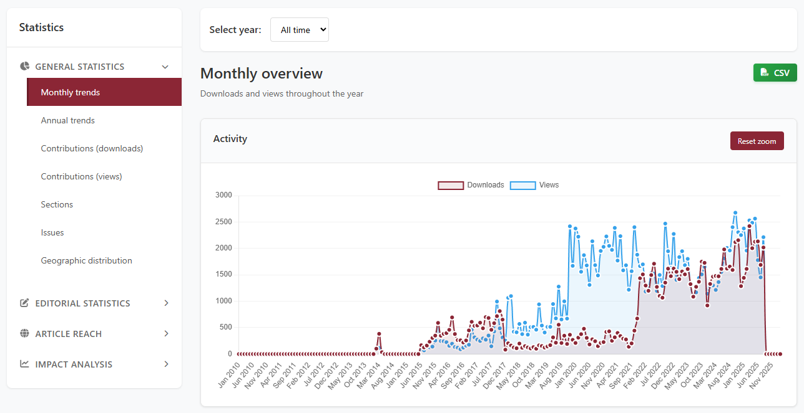
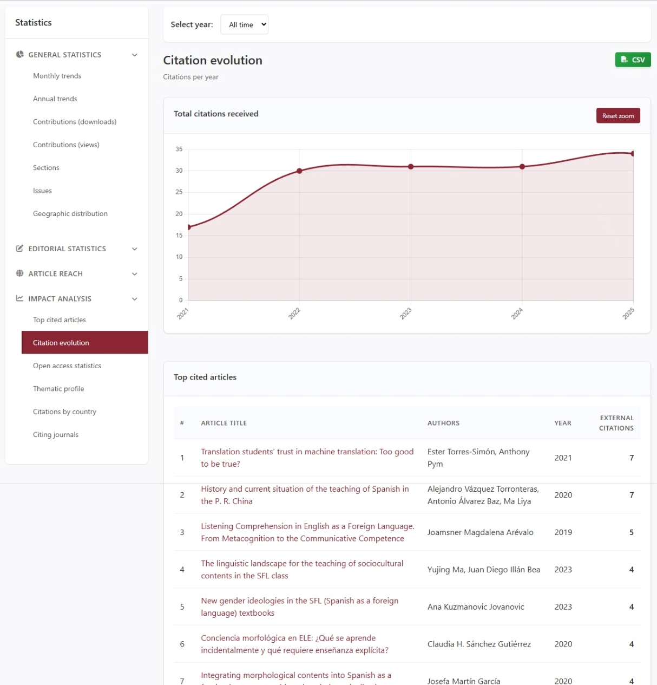
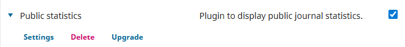
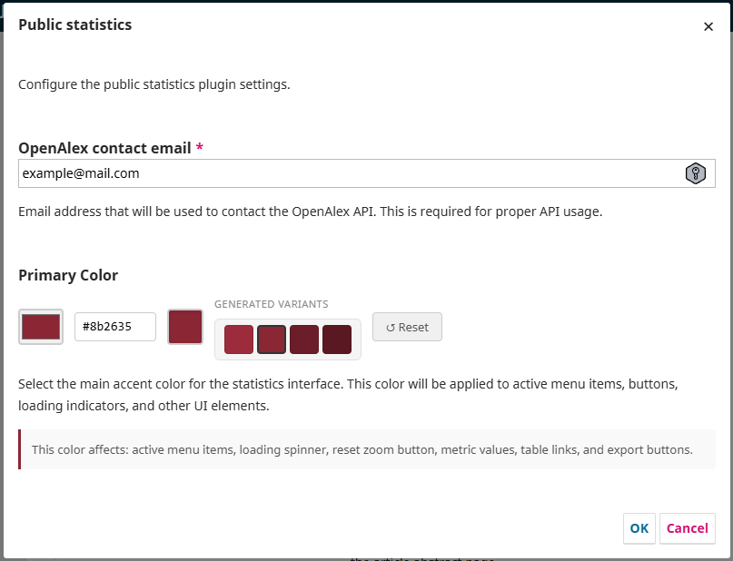
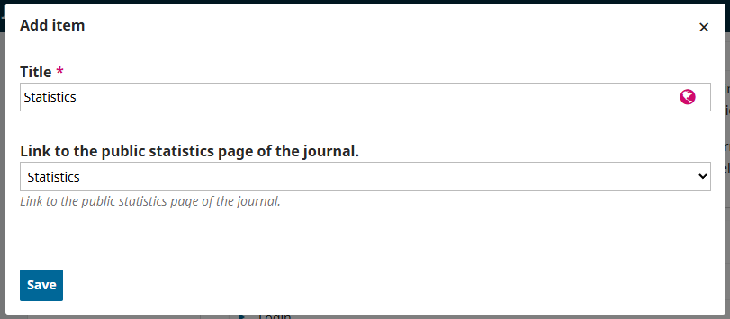
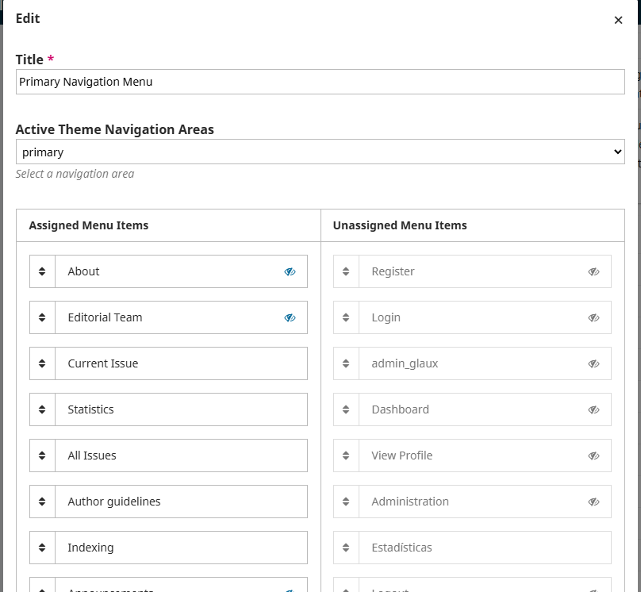
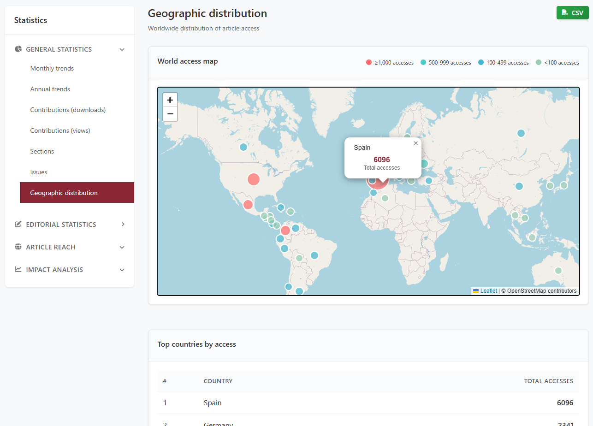

# Public Statistics Plugin for OJS 3.4

Public-facing statistics page for Open Journal Systems. Adds a dashboard with usage, editorial, geographic and OpenAlex-based impact metrics, available to every reader of your journal.



## Features

- **Usage statistics**: Views and downloads by article, issue, section, and country
- **Author & reviewer metrics**: Geographic distribution, institutional affiliation, and per-year reviewer list
- **Editorial analytics**: Processing times, decision rates, and workflow metrics
- **Citation data** _(needs queue worker)_: Integration with OpenAlex for citation counts, citing journals, and thematic profiles
- **Open Access statistics** _(needs queue worker)_: Distribution of OA types across publications
- **Interactive visualizations**: Charts, maps, and filterable tables
- **CSV export**: Export any dataset for further analysis
- **Multilingual**: Available in English, Spanish, and Catalan
- **Customizable**: Configurable primary color theme

All sections except the OpenAlex ones work as soon as the plugin is enabled. The OpenAlex sections (Impact group and the citation/OA counters on the overview) need OJS to be processing background jobs. See [Background queue](#background-queue-required-only-for-the-impact-sections).



## Requirements

- OJS 3.4.0
- PHP 8.1 or higher

## Installation

### Step 1: Download and Extract

Download the plugin and extract it to your OJS plugins folder. The final structure should be:

```
ojs/
└── plugins/
    └── generic/
        └── publicStats/
            ├── controllers/
            ├── classes/
            ├── helpers/
            ├── jobs/
            ├── services/
            ├── templates/
            ├── locale/
            ├── PublicStatsPlugin.php
            ├── PublicStatsSettingsForm.php
            └── version.xml
```

### Step 2: Enable the Plugin

1. Log in to your OJS installation as an administrator
2. Navigate to **Settings > Website > Plugins**
3. Find **Generic Plugins**
4. Find "Public Statistics" in the list and check the box to enable it



### Step 3: Configure Plugin Settings

1. Click the arrow next to the plugin name to expand options
2. Click **Settings**
3. Configure the following:

| Setting                    | Description                                                                                    |
| -------------------------- | ---------------------------------------------------------------------------------------------- |
| OpenAlex Email             | Contact email sent to OpenAlex on each API call (see note below). Optional.                    |
| Active statistics sections | Visibility toggle for each subsection. See [Enable/disable sections](#enabledisable-sections). |
| Primary Color              | Theme color for the dashboard. Optional.                                                       |



4. Click **Ok**

#### About the OpenAlex Email

The email field is optional. There's no OpenAlex account to register: the address is sent as a `mailto` query parameter so OpenAlex can route your requests through its polite pool, which is faster and more reliable than the anonymous one. Without an email the plugin still works, just less consistently under load.

Use your journal's contact email or an institutional address. It is only sent to OpenAlex and is not shared with anyone else.

### Step 4: Add Navigation Menu Link

To make the statistics page accessible to your readers:

1. Go to **Settings > Website > Setup > Navigation**
2. Click **Add Item**
3. In **Navigation Menu Item Type**, select **Statistics**
4. Enter a **Title** for the menu item (e.g., "Statistics" or "Journal Metrics")
5. Click **Save**



6. Now click **Edit** on the menu where you want the link to appear (e.g., "Primary Navigation Menu")
7. Find your new item in the **Unassigned** list
8. Drag it to the **Assigned** list in your preferred position
9. Click **Save**



### Step 5: Verify Installation

Visit your journal's statistics page to verify everything works correctly:

```
https://your-journal.com/publicStats/total
```

You should see the statistics dashboard with your journal's data.

On the first load every section renders immediately except the OpenAlex-powered ones (top cited, citation evolution, open access stats, thematic profile, citations map, citing journals) and the citation/OA counters on the overview. Those show a "computing…" placeholder until a queue worker finishes processing them. If you're not going to use them, disable them in settings and skip the worker setup. The setup itself takes one checkbox in OJS, see [Background queue](#background-queue-required-only-for-the-impact-sections).

## Configuration

### OpenAlex Integration

The plugin uses [OpenAlex](https://openalex.org/) to retrieve citation metrics. OpenAlex is a free, open catalog of scholarly works.

Features powered by OpenAlex:

- Citation counts and evolution
- Citing journals analysis
- Thematic profile (research topics)
- Citations by country
- Open Access status

Aggregated results are cached for 7 days; only the initial computation is expensive.

Building these aggregates over a whole journal can take several minutes on large catalogues, so the plugin runs the work on the OJS background-jobs queue. The Impact sections (top cited, citation evolution, open access stats, thematic profile, citations map, citing journals) and the citation/OA counters on the overview will display a loading placeholder while that happens; subsequent visits read straight from cache. The CSV-only `citing institutions` export goes through the same queue, so the first export request will also wait for the worker.

#### Background queue: required only for the Impact sections

The six Impact sections (plus the OpenAlex counters on the overview) need an active queue worker. Everything else in the plugin (usage stats, editorial, geographic, reviewer list, language trends, author dashboard, etc.) is computed on demand inside the HTTP request and cached locally, so it works without a worker.

The simplest way to activate a worker in OJS is the bundled Acron plugin:

1. Go to Settings > Website > Plugins > Generic Plugins.
2. Find Acron and tick its checkbox.
3. From then on, Acron will dispatch pending jobs on every HTTP request to the journal.

If Acron is not a good fit (very low traffic, or you'd rather run a dedicated worker), add a cron entry on the server:

```bash
* * * * * php /path/to/ojs/tools/jobs.php run
```

You only need one of the two.

If you don't plan to run any worker, open the plugin settings and disable the six Impact subsections. The rest of the dashboard keeps working untouched. The OpenAlex counters on the overview will still try to compute on first load and stay on "computing…"; disable them via settings if you want them gone.

To check whether jobs are actually being processed, look at the OJS `jobs` table in the database. If rows accumulate and never disappear, no worker is running.

### Enable/disable sections

Each subsection listed in [Usage](#usage) can be turned on or off independently:

1. Open Settings > Website > Plugins > Public Statistics > Settings.
2. Under "Active statistics sections", expand any group.
3. Tick or untick each subsection. The group checkbox toggles all children at once.
4. Click Ok.

A disabled subsection is hidden from the sidebar and the page output, and its data is never queried. New subsections added in future plugin updates appear in the form the next time it is opened.

### Customization

The interface color theme is configurable from the plugin settings. The chosen color applies to active sidebar items, the loading indicator, reset-zoom buttons, metric values, table links and export buttons. The form previews the four shades derived from your choice (light, primary, dark, darker).

## Usage

The statistics page is accessible at:

```
https://your-journal.com/publicStats/total
```

The dashboard groups statistics into four categories (General, Editorial, Reach, Impact). Each subsection can be enabled or disabled independently from the plugin settings; see [Enable/disable sections](#enabledisable-sections).

### General

- **Monthly trends**: views and downloads aggregated by month
- **Annual trends**: the same data, aggregated by year instead
- **Top downloads**: your most-downloaded articles
- **Top views**: your most-viewed articles
- **By section**: distribution across journal sections
- **By issue**: metrics broken down per issue
- **Language distribution**: published articles by language, with a per-issue filter
- **Language trends**: yearly evolution of articles per language (zoomable chart)
- **Geographic distribution**: readers by country, shown as a world map plus a table

### Editorial

- **Author dashboard**: publications, downloads and views for each author
- **Monthly submissions**: received / published / declined / in-process timeline
- **Annual submissions**: the same submission data, aggregated by year
- **Authors by country / institution**: where your contributors come from
- **Reviewers by country / institution**: where your reviewers come from
- **Reviewer list**: alphabetical public list of reviewers who completed reviews each year
- **First-decision time**: average days from submission to first decision
- **Acceptance-to-publication time**: average days from accepted to published
- **Rejection rate**: declined/received ratio per year, with an overall rate and the peak year

### Reach

- **Most downloaded (last 60 days)**
- **Most viewed (last 60 days)**

### Impact _(requires OpenAlex)_

- **Top cited**: most-cited articles, all-time and per year
- **Citation evolution**: citations received per year
- **Open Access stats**: the Diamond / Gold / Hybrid / Green / Bronze / Closed breakdown
- **Thematic profile**: research areas inferred from OpenAlex topics
- **Citations by country**: where citations originate geographically
- **Citing journals**: the top journals citing your articles, with a per-article drill-down



## Data Export

Every section has a CSV export button, with one exception: **Rejection rate** reuses the Annual submissions data displayed elsewhere and has no export of its own, so use the Annual submissions export instead. Exports use the same data the section displays and respect the active filters (year, issue, etc.).

## Support

For issues or feature requests, contact the plugin maintainer.

## For developers

Standard OJS 3.4 plugin layout: services hold the business logic, traits group the HTTP endpoints, the JS dashboard is split into small modules attached to `window.PublicStats`.

### Backend

- `controllers/PublicStatisticsHandler.php` is the page handler. Each public method is a JSON or HTML endpoint registered on the `publicStats` page route.
- `controllers/traits/*Trait.php` group endpoints by feature (article rankings, editorial, author/reviewer, impact, CSV exports). Traits are thin HTTP wrappers; logic lives in services.
- `services/*.php`: business logic, one service per domain (statistics, articles, editorial, language, OpenAlex, CSV export).
- `jobs/*.php` hold the Laravel queue jobs for heavy OpenAlex aggregations. They run via the OJS queue worker (`acron` plugin or `php tools/jobs.php run`).
- `classes/PublicStatsConstants.php` is the central registry of subsection IDs and their group; adding a subsection here is enough for it to appear in the settings form.
- `classes/Logger.php` wraps `error_log` and prefixes every line with `[publicStats]`. Use `Logger::error($msg, $exception)` and `Logger::warning($msg)`; never call `error_log` directly.

### Frontend

The dashboard JS is split across seven files in `templates/js/`:

| File                    | Responsibility                                 |
| ----------------------- | ---------------------------------------------- |
| `statistics-helpers.js` | Shared utilities (escapeHtml, ChartConfig, …)  |
| `statistics-api.js`     | API client + CSV export buttons                |
| `statistics-charts.js`  | Chart.js renderers                             |
| `statistics-tables.js`  | Table builders                                 |
| `statistics-maps.js`    | Leaflet renderers                              |
| `statistics-impact.js`  | Author dashboard + Impact (OpenAlex) renderers |
| `statistics.js`         | Orchestrator: navigation, year changes, init   |

Each module attaches itself to `window.PublicStats.*`; the orchestrator picks them up and wires section navigation. The load order is enforced from `PublicStatisticsHandler::setupAssets()`.

### Adding a new section

1. Add the subsection id to `PublicStatsConstants::SUBSECTIONS` under the right group.
2. Implement the data layer in `services/` (one method per metric, returning plain arrays).
3. Add an endpoint method on the relevant trait in `controllers/traits/` (article rankings, editorial, author/reviewer or impact). The handler picks up traits via `use ...Trait;`, so the new method is wired automatically.
4. Register an `API.get<Foo>` wrapper in `statistics-api.js` and a renderer (chart, map or table) in the matching frontend module.
5. Add the sidebar item and the content section to `templates/publicStats.tpl`, plus a handler entry in `Navigation.initializeSectionContent` (`statistics.js`). If the new section needs an i18n string in JS, add it to the bag built by `PublicStatisticsHandler::buildJsI18nJson()`.
6. Add translation keys to `locale/<code>/locale.po` for each supported language.
7. If the data is expensive to compute (per-DOI OpenAlex calls or similar), wire it through the chunked-job pattern instead: add a `TYPE_*` constant to `ComputeOpenAlexAggregateJob`, register it in `CHUNKED_TYPES`, and expose the wrapper via `readOrAdvanceChunked`.

### Adding a translation

Copy `locale/en/locale.po` to `locale/<your-code>/locale.po` and translate the `msgstr` lines. The locale code must match an OJS-supported locale (e.g. `pt_BR`, `de`, `fr_CA`).

## Credits

This plugin was developed with the support of:

&nbsp;


**Universitat Rovira i Virgili** funded the development of this plugin.

&nbsp;


**Glaux Publicaciones Académicas** designed and built the plugin.

&nbsp;

## License

This plugin is licensed under the GNU General Public License v3.0.
